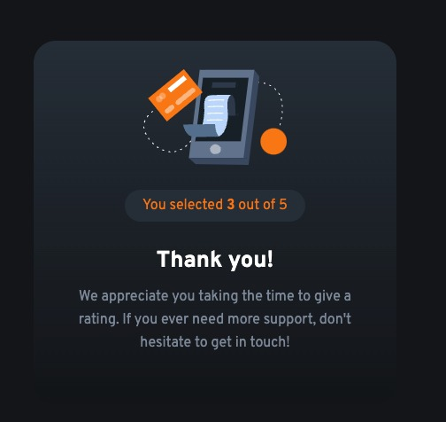

# Frontend Mentor - Interactive rating component solution

This is a solution to the [Interactive rating component challenge on Frontend Mentor](https://www.frontendmentor.io/challenges/interactive-rating-component-koxpeBUmI). Frontend Mentor challenges help you improve your coding skills by building realistic projects. 

## Table of contents

- [Overview](#overview)
  - [The challenge](#the-challenge)
  - [Screenshot](#screenshot)
- [My process](#my-process)
  - [Built with](#built-with)
  - [What I learned](#what-i-learned)

**Note: Delete this note and update the table of contents based on what sections you keep.**

## Overview

### The challenge

Users should be able to:

- View the optimal layout for the app depending on their device's screen size
- See hover states for all interactive elements on the page
- Select and submit a number rating
- See the "Thank you" card state after submitting a rating

### Screenshot




### Built with

- Html
- Scss
- Webpack
- React
- Npm

### What I learned

To see how you can add code snippets, see below:

Add event to html element
```html
<button className="rating-vote-button" onClick={voteClick}>1</button>
```

Scss Gradient
```css
.gradient {
  background: linear-gradient(180deg, $blue, $darkBlue);
}
```

React Hook useState
```js
const [vote, setVote] = useState(0);
```
